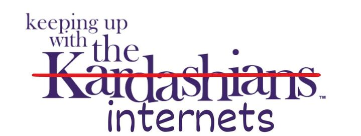
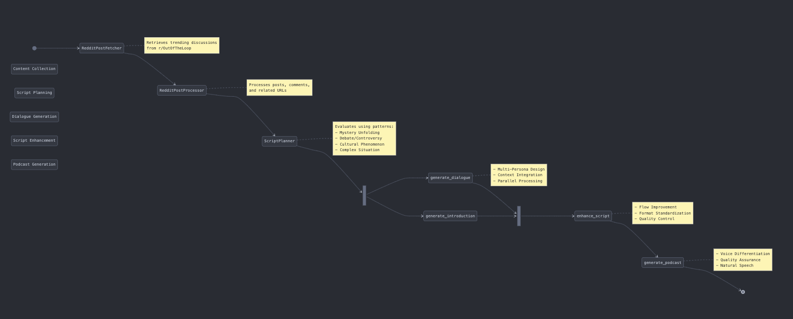

<div align="center">
  
  <p align="center">
    <strong>AI-Powered Internet Culture Podcasts</strong><br>
    Transforming Reddit's most intriguing discussions into engaging audio content
  </p>

<p align="center">
    <a href="#overview">Overview</a> •
    <a href="#key-features">Features</a> •
    <a href="#architecture">Architecture</a> •
    <a href="#getting-started">Getting Started</a> •
    <a href="#contributing">Contributing</a>
  </p>
</div>

______________________________________________________________________

## 🌟 Overview

Ever felt overwhelmed trying to keep up with internet culture? We transform r/OutOfTheLoop's most engaging discussions into natural, conversational podcasts – making it easy to stay informed while on the go.

### ✨ Key Features

- 🎯 **Smart Content Curation** - Automatically selects the most meaningful discussions
- 🎭 **Multi-Persona Dialogue** - Natural conversations between different personas
- 🔍 **Deep Context Integration** - Synthesizes information from posts, comments, and related links
- 🎙️ **Professional Audio** - Converts discussions into podcast-ready content
- 🚀 **Weekly Updates** - Fresh episodes covering the latest internet phenomena

## 🛠️ Architecture

The project uses LangGraph for orchestrating the podcast generation workflow:

<div align="center">
  
</div>

<details>
<summary>Core Components</summary>

#### 1. Content Collection & Processing

- **RedditPostFetcher**: Retrieves trending discussions from r/OutOfTheLoop
- **RedditPostProcessor**: Processes posts, comments, and related URLs

#### 2. Script Planning & Generation

- **ScriptPlanner**: Evaluates and structures content using 4 core patterns:
  - Mystery Unfolding: Reveals information progressively
  - Debate/Controversy: Explores multiple perspectives
  - Cultural Phenomenon: Analyzes trending topics
  - Complex Situation: Breaks down intricate issues
- **Multi-Persona Design**: Orchestrates natural dialogue flow

#### 3. Dialogue Generation

- **DialogueGenerator**: Creates dynamic conversations
- **Context Integration**: Weaves in URLs, comments, and background
- **Parallel Processing**: Generates reddit post specific dialogues concurrently

#### 4. Script Enhancement

- **ScriptEnhancer**: Improves flow and reduces redundancy
- **Format Standardization**: Ensures consistent dialogue structure
- **Quality Control**: Maintains speaker authenticity

#### 5. Podcast Generation

- **Audio Synthesis**: Converts enhanced scripts to natural speech
- **Voice Differentiation**: Distinct voices for Host, Learner, and Expert
- **Quality Assurance**: Ensures proper pacing and pronunciation

</details>

## 🚀 Getting Started

### Installation

1. Clone the repository

```bash
git clone https://github.com/kaushikb11/keepingupwiththeinternets.git
cd keepingupwiththeinternets
```

2. Create and activate a virtual environment

```bash
python3 -m venv venv
source venv/bin/activate  # On Windows: venv\Scripts\activate
```

3. Install dependencies

```bash
pip install -r requirements.txt
```

4. Configure environment variables

```bash
cp .env.example .env
# Edit .env with your API credentials:
# - REDDIT_CLIENT_ID
# - REDDIT_CLIENT_SECRET
# - ELEVEN_LABS_API_KEY
```

### Basic Usage

Generate a podcast from r/OutOfTheLoop's top posts:

```bash
python3 main.py
```

### Advanced Usage

For automated weekly podcast generation, you can deploy the agent using [Modal](https://modal.com/):

1. Install Modal

```bash
pip install modal
```

2. Set up Modal authentication

```bash
python3 -m modal setup
```

3. Add secrets to Modal either through the CLI or the web interface

```bash
python3 -m modal secret create keepingupwiththeinternets-secrets \
REDDIT_CLIENT_ID=<your-value> \
REDDIT_CLIENT_SECRET=<your-value> \
REDDIT_USER_AGENT=<your-value> \ .....
```

1. Deploy the scheduled job

```bash
python3 -m modal deploy modal_app.py
```

The deployment will:

- Run automatically every week
- Store podcasts in Modal's persistent storage
- Handle all dependencies and environment setup

You can monitor your deployments in the [Modal dashboard](https://modal.com/apps).

## 🤝 Contributing

Contributions are welcome! Feel free to submit a pull request or open an issue.

1. Fork the repository
1. Create your feature branch (`git checkout -b feature/AmazingFeature`)
1. Commit your changes (`git commit -m 'Add some AmazingFeature'`)
1. Push to the branch (`git push origin feature/AmazingFeature`)
1. Open a Pull Request

## 📝 License

This project is licensed under the Apache License 2.0 - see the [LICENSE](LICENSE) file for details.

## 🙏 Acknowledgments

- [paper_to_podcast](https://github.com/Azzedde/paper_to_podcast) for components inspiration
- Reddit's r/OutOfTheLoop community
- [ElevenLabs](https://elevenlabs.io) for voice synthesis
- [Firecrawl](https://www.firecrawl.dev/) for web content extraction
- [LangGraph](https://github.com/langchain-ai/langgraph) for workflow orchestration
